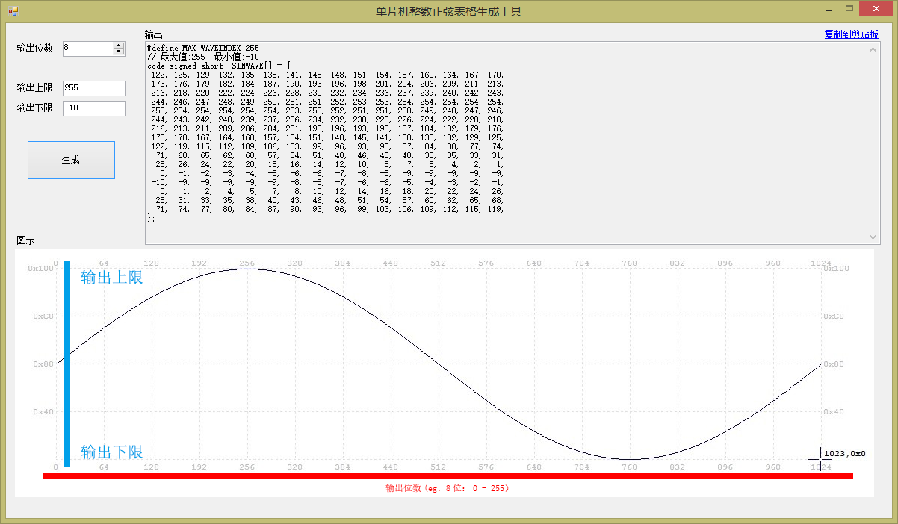

单片机整数正弦表生成器
===================================

### 根据提供的数据精度、上限、下限要求，生成C51的代码表格 				

### 运行环境 [.Net Framework 4](http://www.microsoft.com/zh-cn/download/details.aspx?id=17718) 

### 特点
> 代码自动美化
>
> 数据格式自动化
>
> 内置详细注释
>

### 下载
> [V1:](./MCU_SINCOS_TABLE_CREATER/master/Out/V01.exe)
>

开源双核单片机学习板配套工具之一
-----------------------------------

[上海电子信息职业技术学院 电子工程系提供](http://www.dianzigc.cn/)

